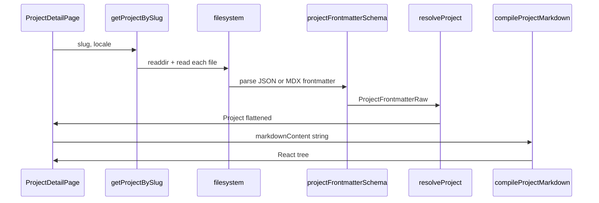

# 4. Dynamic Project Generation

## 4.1 Pipeline completo



## 4.2 Descubrimiento de archivos

**Directorio:** `content/projects/`

**Extensiones:** `.json`, `.mdx` (case-sensitive en Windows igual)

**Slug:**

```
slug = frontmatter.slug ?? filenameWithoutExtension
```

Ejemplo: `drone-flight-controller.json` → slug `drone-flight-controller`

## 4.3 Ordenamiento

`getAllProjects(locale)` ordena por `date` **descendente** (ISO string comparado como `Date`).

No hay orden manual, peso, ni `sortOrder` field.

## 4.4 Featured logic

- Campo booleano `featured` en archivo de proyecto.
- `getFeaturedProjects(locale)` = filter `featured === true` + mismo sort por fecha.
- Home usa solo featured; `/projects` lista todos.

**CMS:** toggle `featured` por proyecto; no hay límite de cantidad en código (UI muestra todos los featured).

## 4.5 JSON vs MDX

| Aspecto | JSON | MDX |
|---------|------|-----|
| Autoría | 100% en un archivo | Frontmatter YAML + body opcional |
| markdownContent | Campo `{es,en}` en JSON | Preferido en frontmatter; body fallback |
| Body fallback | N/A | Si no hay `markdownContent`, body MDX se copia a **ambos** idiomas |
| `tagIds` | `string[]` | Ids en `content/registries/tags.json` |
| `updatedAt` | ISO opcional | Sitemap `lastModified` |
| `seo` | opcional | `title`, `description`, `noindex` por locale |

## 4.6 Renderizado detalle

**Página:** `app/[locale]/projects/[slug]/page.tsx`

Secciones (anchors):

| ID | Condición | Componente |
|----|-----------|--------------|
| `overview` | siempre | description + video iframe |
| `technical` | `technicalDetails.length > 0` | tabla dl |
| `metrics` | `metrics.length > 0` | MetricsBlock |
| `gallery` | `galleryImages.length > 0` | ProjectGallery (client) |
| `writeup` | `markdownContent` truthy | MDX prose |

**Sidebar:** links `#overview`, etc.; `activeSection` prop **nunca pasada** (scroll spy no implementado).

## 4.7 Filtros en listado

**Componente:** `ProjectsFilter` (client)

- Filtra por `status` enum: `completed`, `in-progress`, `archived`.
- Filtra por `tags` — **strings del locale activo** (ES y EN pueden tener tags distintos).
- No hay búsqueda full-text, categorías, ni paginación.

## 4.8 Performance / deuda

```typescript
// getProjectBySlug hoy:
const all = await getAllProjects(locale);
return all.find((p) => p.slug === slug);
```

Cada detalle re-parsea **todos** los proyectos. Para CMS/API futuro: índice en memoria con cache o DB query por slug.

## 4.9 Búsqueda futura (no implementada)

Campos indexables sugeridos:

- `title`, `shortDescription`, `description` (por locale)
- `technologies[]` (shared)
- `tags[]` (per locale)
- `status`, `date`, `featured`

Implementación natural: Lunr/Flexsearch en build o endpoint CMS con Postgres full-text.

## 4.10 Ejemplo JSON mínimo

Ver `content/projects/README.md` y `schemas/project.frontmatter.schema.json`.
