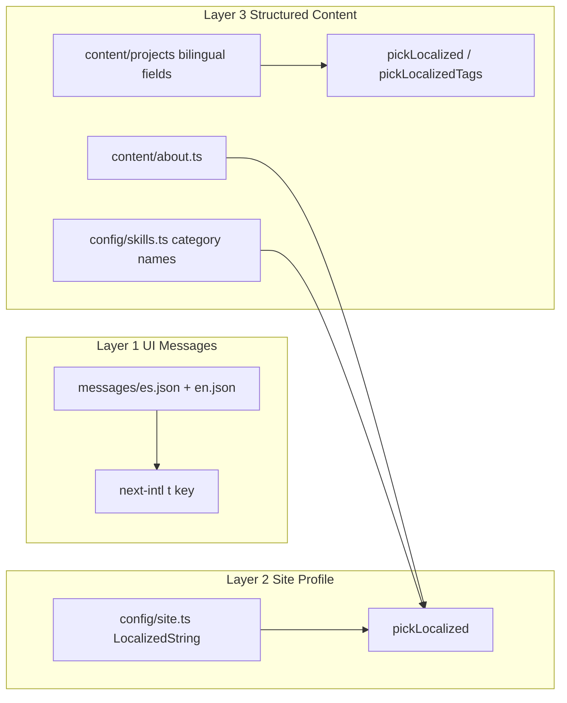

# 5. Translation / i18n System

## 5.1 Tres capas de traducción (crítico)

El sitio **no** usa un solo sistema i18n. Hay tres capas independientes:



| Capa | Archivos | Mecanismo | Consumido por |
|------|----------|-----------|---------------|
| UI | `messages/{locale}.json` | Claves anidadas `namespace.key` | `useTranslations`, `getTranslations` |
| Perfil | `config/site.ts` | `{ es, en }` inline | `getSiteConfig(locale)` |
| Contenido | projects, about, skills | `{ es, en }` o arrays bilingües | loaders + resolvers |

## 5.2 UI messages (next-intl)

**Carga:** `i18n/request.ts` importa dinámicamente `../messages/${locale}.json`.

**Namespaces actuales:**

| Namespace | Uso |
|-----------|-----|
| `meta` | **DUPLICADO / NO USADO** — copia de site config |
| `nav` | Header, mobile nav |
| `hero` | Eyebrow, CTAs (no description — viene de site) |
| `featured`, `skills`, `cta` | Secciones home |
| `projects` | Listado, 404, back link |
| `status` | Badges estado proyecto |
| `projectDetail` | Labels secciones detalle |
| `about`, `contact` | Páginas estáticas |
| `footer` | Pie |
| `language` | **Parcialmente no usado** (switcher hardcodea `es`/`en`) |

**Regla CMS:** cualquier clave en `es.json` **debe** existir en `en.json` con la misma estructura.

**Interpolación:**

```json
"metaDescription": "Sobre {name} — {title}."
```

```typescript
t("metaDescription", { name: site.name, title: site.title });
```

## 5.3 Contenido bilingüe — tipos

**Definición:** `lib/i18n/localized.ts`

```typescript
type LocalizedString = { es: string; en: string };
type LocalizedArray = { es: string[]; en: string[] };
```

**Helpers:**

| Función | Input | Output |
|---------|-------|--------|
| `pickLocalized` | `LocalizedString \| string` | `string` para locale |
| `pickLocalizedTags` | `LocalizedArray \| string[]` | `string[]` |

**Fallback legacy:** si el valor es `string` plano (no objeto), se usa igual para cualquier locale (migración).

**Fallback missing key:** `value[locale] ?? value.es` — si falta EN, cae a ES.

## 5.4 Rutas localizadas

- Misma ruta estructural; solo cambia prefijo `/es` vs `/en`.
- Contenido de página cambia vía `locale` param + resolvers.
- **No** hay fallback de ruta (ej. `/en/foo` no cae a ES).

## 5.5 Metadata localization

| Fuente | ES | EN |
|--------|----|----|
| Layout default | `getSiteConfig("es")` vía param | idem |
| OG locale | `es_AR` | `en_US` |
| Project page | título/descripcion resueltos | idem |
| hreflang | `alternates.languages` en layout y project metadata | `/es/...`, `/en/...` |

## 5.6 Problemas de escalabilidad i18n

### Tags por locale distintos

`drone-flight-controller.json`:

```json
"tags": {
  "es": ["aeroespacial", "control", "stm32"],
  "en": ["aerospace", "control-systems", "stm32"]
}
```

Filtros en `/es/projects` y `/en/projects` muestran chips **diferentes** para el mismo proyecto. El CMS futuro debería usar:

- **Opción A:** `tagIds: ["aerospace"]` + registry traducido,
- **Opción B:** tags shared + `tagLabels[tagId][locale]`.

### Hero description duplicada

- `config/site.ts` → `description` (usado en hero + footer),
- `messages.meta.siteDescription` (no usado).

### About timeline years

`content/about.ts` usa `"2024 — Presente"` para ambos locales en el campo `year` (string único, no bilingüe).

### formatDate

`lib/utils.ts` usa siempre `en-US` — fechas en UI no respetan locale.

## 5.7 ¿MDX bilingüe es óptimo?

**Estado actual:** frontmatter YAML con objetos anidados + `markdownContent.es` / `.en` multiline.

**Pros:** un archivo por proyecto, git-friendly.

**Contras para CMS:**

- YAML multiline frágil para editores WYSIWYG,
- validación más difícil que JSON puro,
- body MDX suelto crea ambigüedad.

**Recomendación CMS:**

- **Fuente de verdad:** JSON en DB/API,
- MDX solo como export format o campo rich-text serializado,
- unificar en `contentBlocks[]` si crece el blog.

## 5.8 Estrategia de fallback recomendada (futuro)

| Prioridad | Regla |
|-----------|-------|
| 1 | Locale solicitado |
| 2 | `defaultLocale` (`es`) |
| 3 | Log warning en build/CMS si falta traducción |
| 4 | Nunca mostrar clave cruda `nav.foo` |

## 5.9 Checklist traducción para editores

- [ ] Par clave ES/EN en messages
- [ ] Campos `{es,en}` en proyectos
- [ ] Tags: decidir registry o mantener arrays paralelos
- [ ] Revisar `technologies` (hoy shared, inglés técnico OK)
- [ ] SEO keywords en `getSiteConfig` o unificar a un solo archivo
