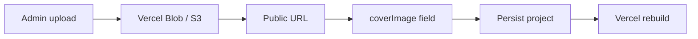

# 8. Image / Content Asset System

## 8.1 Estructura de carpetas

```
public/
└── images/
    └── projects/
        └── {slug}/
            ├── cover.svg | cover.jpg | cover.webp
            ├── gallery-1.svg
            └── gallery-2.svg
```

**Convención:** el `slug` del proyecto coincide con el nombre de carpeta.

## 8.2 Referencia en contenido

En JSON/MDX:

```json
"coverImage": "/images/projects/drone-flight-controller/cover.svg",
"galleryImages": [
  "/images/projects/drone-flight-controller/gallery-1.svg",
  "/images/projects/drone-flight-controller/gallery-2.svg"
]
```

Paths son **public URLs** (empiezan con `/`), no paths relativos al repo sin `public`.

## 8.3 next/image

| Ubicación | Modo | sizes |
|-----------|------|-------|
| ProjectCard | `fill` + aspect 16/10 | responsive vw |
| Detail hero | `fill` aspect 21/9 | 1152px max |
| Gallery main | `fill` aspect video | 66vw |
| Gallery thumbs | `fill` | 120px |

**SVG:** `next.config.ts` habilita `dangerouslyAllowSVG` con CSP sandbox.

## 8.4 Optimización actual

- No hay pipeline de conversión automática a WebP/AVIF en repo.
- Vercel Image Optimization aplica en deploy para formatos raster.
- SVGs no se optimizan por Image API igual que raster.

## 8.5 Naming conventions (recomendadas)

| Asset | Patrón | Ejemplo |
|-------|--------|---------|
| Cover | `cover.{ext}` | `cover.webp` |
| Gallery | `gallery-{n}.{ext}` | `gallery-1.jpg` |
| OG futuro | `og.{ext}` | opcional |

Evitar espacios y mayúsculas en filenames.

## 8.6 Responsive strategy

- `sizes` attribute definido per componente (ver código).
- No hay `srcSet` manual — delegado a Next Image.
- No hay art direction (`<picture>`) por breakpoint.

## 8.7 Pipeline upload futuro (CMS)



**Contrato CMS:**

```json
{
  "coverImage": {
    "url": "https://...",
    "width": 1200,
    "height": 750,
    "alt": { "es": "...", "en": "..." }
  }
}
```

**Hoy:** `alt` = `project.title` en código, no campo separado.

## 8.8 Galería

**Componente:** `ProjectGallery` (client)

- Estado `active` index local,
- thumbnails click → swap main image,
- No lightbox fullscreen, no zoom.

## 8.9 Deuda / riesgos

- Imágenes huérfanas en `public/` si se borra proyecto JSON.
- No validación de que `coverImage` exista en build.
- Alt text no bilingüe dedicado.
