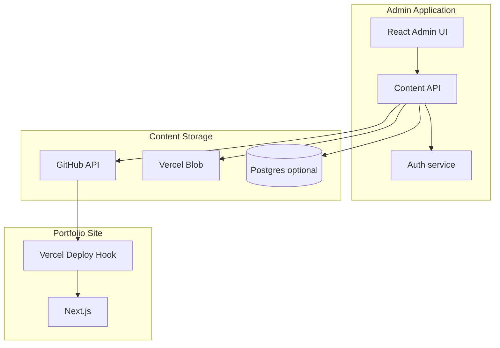

# 15. Content Indexing & 18–20. Future CMS / API / Automation

## 15. Content indexing (estado actual)

No existe índice explícito. El "índice" es:

```typescript
// Implícito: readdir content/projects
getAllProjects(locale) → sorted array
getProjectSlugs() → filenames
```

### Índice recomendado (futuro)

**Archivo generado:** `content/index.json` (build artifact o commit)

```json
{
  "generatedAt": "2026-05-20T12:00:00Z",
  "projects": [
    {
      "slug": "drone-flight-controller",
      "date": "2025-11-15",
      "featured": true,
      "status": "completed",
      "titles": { "es": "...", "en": "..." },
      "tags": { "es": ["..."], "en": ["..."] },
      "technologies": ["STM32F4"],
      "coverImage": "/images/..."
    }
  ]
}
```

**Uso:** Admin app list/search sin parsear todos los MDX; validación CI; preview diff.

---

## 17.5 PortfolioAdminApp (implementado — fase local)

Editor Next.js en `PortfolioAdminApp/` (puerto 3001). Escribe directamente en el repo del sitio vía `PORTFOLIO_ROOT`.

| Method | Path (admin app) | Acción |
|--------|------------------|--------|
| GET/PUT | `/api/content/projects/[slug]` | Leer / guardar proyecto |
| POST | `/api/content/projects` | Crear `{slug}.json` |
| GET/PUT | `/api/content/site` | Perfil |
| GET/PUT | `/api/content/about` | About |
| GET/PUT | `/api/content/skills` | Skills |
| GET/PUT | `/api/content/registries/tags` | Tags |
| GET/PUT | `/api/content/messages/[locale]` | Mensajes UI |
| POST | `/api/assets/upload` | Imagen de proyecto |
| POST | `/api/validate` | Ejecuta `validate:content` en Portfolio |

**Portfolio — revalidación preview:**

| Method | Path | Acción |
|--------|------|--------|
| POST | `/api/admin/revalidate` | `clearContentCache()` + `revalidateTag("projects")` + paths |

Tras cada guardado, el admin llama este endpoint. En `development`, los loaders del sitio omiten caché de módulo y `unstable_cache` para proyectos.

Ver [17-portfolio-admin-app.md](./17-portfolio-admin-app.md).

---

## 18. Future CMS integration architecture

### 18.1 Target topology



### 18.2 Modos de integración (elegir uno)

| Modo | Pros | Contras |
|------|------|---------|
| **Git-based CMS** | Mismo flujo actual; PR previews | Latencia; no WYSIWYG trivial |
| **DB + export** | API CRUD rápida | Requiere export step a JSON |
| **Headless (Sanity/Contentful)** | Editor maduro | Costo; vendor lock |
| **Custom Postgres + API Routes** | Control total | Más desarrollo |

**Recomendación fase 1:** Git-based API (crear/actualizar archivos en repo) + Vercel deploy hook.

**Recomendación fase 2:** Blob para assets + JSON en repo solo con URLs.

### 18.3 Ideal data contracts (REST)

Base: `/api/v1` (en admin app o Next Route Handlers protegidos)

| Method | Path | Acción |
|--------|------|--------|
| GET | `/projects` | Lista índice |
| GET | `/projects/:slug` | Raw bilingual document |
| PUT | `/projects/:slug` | Upsert JSON |
| DELETE | `/projects/:slug` | Remove |
| POST | `/projects/:slug/publish` | Trigger deploy |
| GET | `/site` | Site profile |
| PUT | `/site` | Update profile |
| GET | `/messages/:locale` | UI strings |
| PUT | `/messages/:locale` | Update (validate keys) |
| POST | `/assets/upload` | → Blob URL |

**Auth:** JWT o session; solo editores autorizados.

**Idempotencia:** `PUT` con `etag` / content hash.

### 18.4 Ideal content storage layout (normalized)

```
content/
  site.json
  about.json
  skills.json
  registries/
    tags.json        # id → labels es/en
    technologies.json
  projects/
    {slug}.json      # bilingual document
  index.json         # generated
messages/
  es.json
  en.json
public/
  images/projects/{slug}/
```

### 18.5 Translation storage (CMS)

| Tipo | Storage | Editor UI |
|------|---------|-----------|
| UI chrome | `messages/{locale}.json` | Key-value tree side-by-side |
| Proyecto | fields `{es,en}` en document | Tab ES / Tab EN |
| Registries | central JSON | Autocomplete tags/tech |

**No** duplicar `meta` en messages si site.json es canonical.

### 18.6 Feature matrix (admin app)

| Feature | API | Storage change |
|---------|-----|----------------|
| Edit hero text | PUT site + messages | site.json, hero keys |
| Toggle section home | site flags | `home.sections.skills.enabled` |
| Add project | PUT projects/:slug | new json + images |
| Upload image | POST assets | blob + path |
| Edit translations | PUT messages/* | es.json, en.json |
| Featured toggle | PATCH project | `featured: bool` |
| SEO per project | PATCH project.seo | optional block |
| Navigation | PUT site.navigation | array |

### 18.7 Webhook flow

1. CMS commits via GitHub API or writes DB export.
2. POST Vercel deploy hook.
3. Build runs Zod validation.
4. Fail → CMS shows build log.

---

## 19. API possibilities (Next Route Handlers)

Si el CMS vive separado pero usa el mismo repo:

```
app/api/admin/
  projects/route.ts      # CRUD con token
  projects/[slug]/route.ts
  site/route.ts
  messages/[locale]/route.ts
  upload/route.ts
  deploy/route.ts
```

**Seguridad:** `ADMIN_API_SECRET` header; rate limit; validar Zod antes de write.

Alternativa: CMS app con Octokit directo — sin API en portfolio.

---

## 20. Automation opportunities

| Automación | Trigger | Acción |
|------------|---------|--------|
| Validate content | PR / push | CI: zod + message parity + images |
| Generate index | post-commit | script → content/index.json |
| OG image | project save | playwright screenshot template |
| Translate assist | draft project | AI suggests EN from ES (human review) |
| Stale deploy | content change | Vercel hook |
| Link check | weekly | CI lychee on githubUrl/demoUrl |
| Optimize images | upload | sharp → webp variants |

---

## 17. Vercel deployment structure

| Setting | Valor |
|---------|-------|
| Framework | Next.js (auto) |
| Build | `npm run build` |
| Output | default (`.next`) |
| Env | `NEXT_PUBLIC_SITE_URL` production + preview |
| Middleware | Edge (next-intl) |
| Regions | default |

**Preview URLs:** cada PR → preview con misma env opcional.

**i18n en preview:** `/es` y `/en` funcionan igual.

**No usar** `output: 'export'` — middleware y SSG dinámico requieren server.
